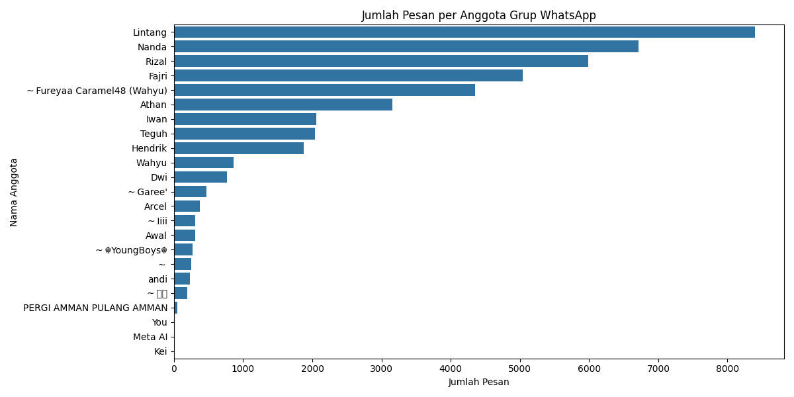

# WhatsApp Analytics Dashboard

A simple Python tool to analyze and visualize WhatsApp group chat patterns.

  

    
  

## Objective
- Count and visualize message frequency per user in WhatsApp groups
- Generate basic statistics about group activity
- Present data in an easy-to-understand bar chart

## Output
- Bar chart visualization (chat_analysis.png)
- Basic chat statistics including:
  - Total messages
  - Most active users 
 
## Source
Export Whatsapp chats
 
#MachineLearning #Python
